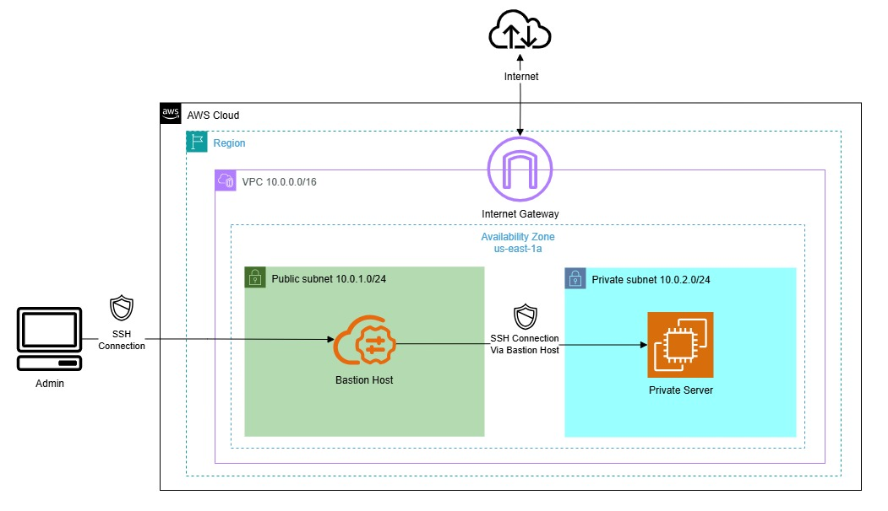

# Bastion Host (WIP)
This project demonstrates how to configure a bastion host in AWS to securely access private infrastructure. The infrastructure is provisioned using Terraform, and the bastion host is configured using Ansible.

## Architecture
<p align="center">
  
</p>

## Project Structure
```bash
.
├── ansible
│   ├── inventory.ini # Ansible inventory file
│   ├── playbook.yml # Ansible playbook to configure the bastion host
│   └── roles\bastion
│       ├── handlers
│       │   └── main.yml # handlers for the bastion host role
│       ├── tasks
│       │   └── main.yml # tasks for the bastion host role
│       └── templates
│           └── jail.local.j2 # template for the jail.local file
└── terraform
    ├── main.tf # Terraform configuration for the AWS infrastructure
    ├── outputs.tf # Terraform outputs
    ├── providers.tf # Terraform providers
    └── variables.tf # Terraform variables
```
## Set Up
### Prerequisites

- AWS account
- Terraform installed
- Ansible installed

### Steps
1. Clone the repository:
    ```bash
    git clone https://github.com/MGhaith/Bastion-Host.git
    cd Bastion-Host
    ```
2. Generate SSH keys:
    - Bastion host key:
        ```bash
        ssh-keygen -t rsa -f ~/.ssh/bastion-key
        ```
    - Private server key:
        ```bash
        ssh-keygen -t rsa -f ~/.ssh/private-server-key
        ```
3. Deploy the infrastructure:
    ```bash
    cd terraform
    terraform init
    terraform apply
    ```
    > **Note**: You will be prompted to enter your public IP address, the bastion host public key path, and the private server public key path. Alternatively, you can set these values in the `terraform/variables.tf` file as default values.

4. Configure SSH Access
    - Update your `~/.ssh/config` file
    ```bash
        Host bastion
            HostName <bastion-public-ip> # replace with the bastion host public IP
            User ec2-user
            IdentityFile ~/.ssh/bastion-key # replace with the path to the bastion host private key

        Host private-server
            HostName <private-server-private-ip> # replace with the private server private IP
            User ec2-user
            ProxyJump bastion
            IdentityFile ~/.ssh/private-server-key # replace with the path to the private server private key
    ```
    - Test the SSH connection to the bastion host:
        ```bash
        ssh bastion            # Connect to bastion
        ```
    - Test the SSH connection to the private server:
        ```bash
        ssh private-server     # Directly connect (auto-jumps through bastion)
        ```

5. Update `inventory.ini`:
   - After a successful deployment, update the `ansible/inventory.ini` file with the Terraform outputs.
        ```bash
        terraform output bastion_public_ip
        terraform output private_server_private_ip
        ```
    - Update the `inventory.ini` file with the paths to private keys (e.g., `~/.ssh/bastion-key` and `~/.ssh/private-server-key`):
6. Run the Ansible playbook:
    ```bash
    cd ../ansible/
    ansible-playbook -i inventory.ini playbook.yml
    ```
### Result
By the end of this project, you will have a secure bastion host configured in AWS, with Fail2ban protecting SSH, root login disabled, and a firewall active. The private server will also have security patches auto-installed.
- Bastion host:
    - Fail2ban protecting SSH
    - Root login disabled
    - Firewall active
- Private server:
    - Security patches auto-installed

## Infrastructure Destruction
To destroy the infrastructure created by this project, run the following command:
```bash
cd terraform
terraform destroy
```
## License
This project is licensed under the MIT License - see the [LICENSE](https://github.com/MGhaith/Bastion-Host/blob/main/LICENSE) file for details.
